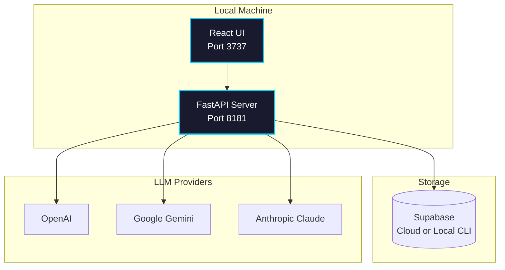

import Tabs from '@theme/Tabs';
import TabItem from '@theme/TabItem';
import Admonition from '@theme/Admonition';

# Configuration

## Direct Install Architecture

Archon now runs as two local services: a FastAPI backend and a Vite-powered frontend. They communicate over HTTP/WebSockets on `localhost`.



## Port Mappings

| Service | Port | Purpose |
|---------|------|---------|
| Frontend | 3737 | React UI served by Vite |
| Server | 8181 | FastAPI + Socket.IO |

Set custom ports via `.env`:

```bash
ARCHON_UI_PORT=3737
ARCHON_SERVER_PORT=8181
```

Restart the FastAPI process and the UI dev server after changing these values.

## Environment Variables

Create a `.env` file in the repository root.

```bash
# Supabase
SUPABASE_URL=https://your-project.supabase.co
SUPABASE_SERVICE_KEY=service_role_key

# Optional overrides
ARCHON_SERVER_PORT=8181
HOST=127.0.0.1

# Logging
LOGFIRE_ENABLED=false
# LOGFIRE_TOKEN=pylf_...
```

Provider API keys (OpenAI, Gemini, Claude) are entered through **Settings → API Keys** and encrypted before they are stored.

## Provider Configuration

Use **Settings → RAG Settings** to choose:

- Default chat model (OpenAI, Google Gemini, or Anthropic Claude)
- Embedding provider (OpenAI today, with fallback messaging when unavailable)
- Retrieval options such as hybrid search and reranking

The UI validates that the FastAPI server has access to the required credentials before allowing you to save a configuration.

## Supabase Options

<Tabs>
<TabItem value="cloud" label="Supabase Cloud">

- Easiest path—create a free project and copy the `Project URL` + `service_role` key.
- Database remains hosted; Archon stores only its own tables.

</TabItem>
<TabItem value="local" label="Supabase CLI">

```bash
supabase init
supabase start
```

This spins up Postgres + Studio locally. Use the printed connection details in `.env`.

</TabItem>
</Tabs>

## Service URLs

The UI automatically proxies to the backend using the host/port values above. When exposing Archon to another machine:

1. Set `HOST` in `.env` to the machine’s IP or hostname.
2. Restart the FastAPI server and Vite dev server.
3. Access the UI via `http://HOST:ARCHON_UI_PORT`.

## Troubleshooting

- **Connectivity errors**: Verify the FastAPI server is running on port 8181 (`curl http://127.0.0.1:8181/health`).
- **Supabase authentication failures**: Double-check the `service_role` key in `.env` and rerun migrations.
- **Missing embeddings**: Claude currently uses OpenAI embeddings—add an OpenAI key if you select Claude as the chat provider.

<Admonition type="info" title="Legacy Docker Stack">
The previous Docker Compose + MCP deployment is still available in the repository under `docker-compose.yml`. Those instructions are now considered legacy and are no longer maintained in this guide.
</Admonition>
