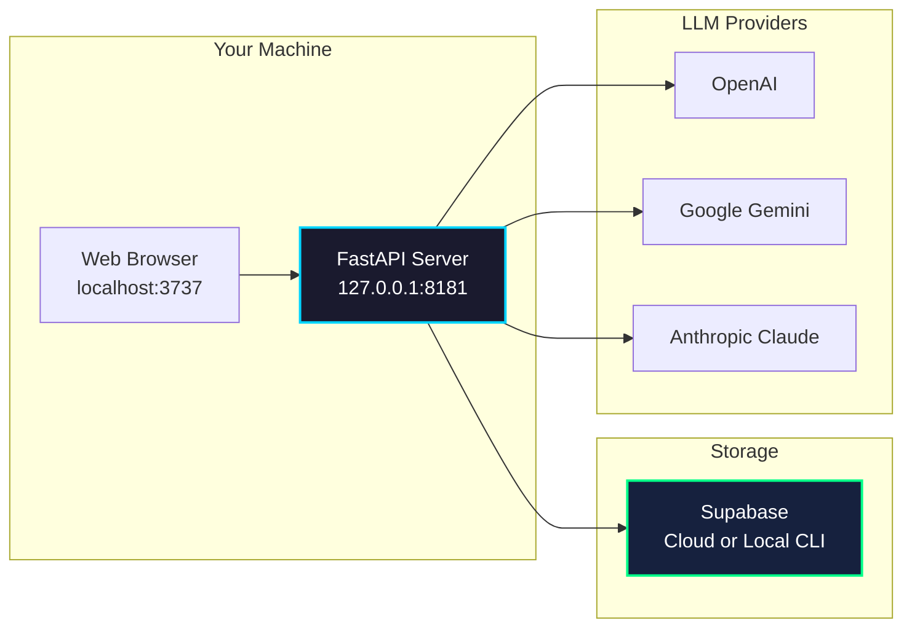

import Tabs from '@theme/Tabs';
import TabItem from '@theme/TabItem';
import Admonition from '@theme/Admonition';

# Deployment

## Quick Start

<Admonition type="tip" title="Prerequisites">
- Python 3.12 (with [uv](https://docs.astral.sh/uv/) recommended)
- Node.js 18+
- Git for cloning the repository
- Supabase project or the Supabase CLI for local storage
</Admonition>

### 1. Clone & Copy Environment

```bash
git clone https://github.com/coleam00/Archon.git
cd Archon

cp .env.example .env
```

### 2. Configure Supabase

Update `.env` with your Supabase URL and `service_role` key.

<Tabs>
<TabItem value="cloud" label="Supabase Cloud">

1. Create a project at [supabase.com](https://supabase.com).
2. In **Project Settings → API**, copy the `Project URL` and `service_role` key.
3. Paste those values into `.env`.

</TabItem>
<TabItem value="local" label="Supabase CLI">

```bash
supabase init       # one time per repository
supabase start      # launches Postgres + Studio locally
```

The CLI prints a local URL and service role key—use them in `.env`.

</TabItem>
</Tabs>

### 3. Run Database Migrations

Open the Supabase SQL editor (cloud or local Studio) and run `migration/complete_setup.sql` to create Archon tables and functions.

### 4. Install Dependencies

```bash
# Backend
cd python
uv sync
cd ..

# Frontend
cd archon-ui-main
npm install
cd ..
```

### 5. Start Services

```bash
# Terminal 1 - FastAPI server
cd python
uv run python -m src.server.main

# Terminal 2 - React UI
cd archon-ui-main
npm run dev -- --host 0.0.0.0 --port 3737
```

Visit [http://localhost:3737](http://localhost:3737) and complete onboarding by pasting an API key for OpenAI, Google Gemini, or Anthropic Claude.

## Hot Module Reload (HMR)

<Admonition type="tip" title="Built-in Hot Reload">
Archon ships with hot reload for both the FastAPI server and the Vite-based UI. Save your changes and both stacks update instantly.
</Admonition>

### Python Server

- Run with `uv run uvicorn src.server.main:app --reload` during development.
- File changes trigger an automatic restart.
- WebSocket clients reconnect after the server comes back online.
- Install new dependencies with `uv add <package>` and restart the command.

### React UI

- `npm run dev` uses Vite's fast refresh.
- Component state is preserved when possible.
- Tailwind and CSS changes appear without a full reload.
- Add new dependencies via `npm install <package>` and restart the dev server if needed.

### Tips

1. **Monitor Logs**: The FastAPI terminal prints reload events; Vite shows compilation output in its terminal.
2. **Handle Disconnects**: The UI temporarily shows a reconnect toast while the backend restarts.
3. **State Persistence**: Database data lives in Supabase, so reloading the services does not wipe your documents or tasks.

## Service Architecture



## Common Commands

<Tabs>
<TabItem value="backend" label="Backend">

```bash
# Start with auto-reload
uv run uvicorn src.server.main:app --reload --host 0.0.0.0 --port 8181

# Run tests
uv run pytest

# Install a new dependency
uv add <package>
```

</TabItem>
<TabItem value="frontend" label="Frontend">

```bash
# Start dev server
npm run dev

# Run unit tests
npm test

# Add a dependency
npm install <package>
```

</TabItem>
<TabItem value="supabase" label="Supabase CLI">

```bash
# Start local stack
supabase start

# View logs
supabase logs

# Stop services
supabase stop
```

</TabItem>
</Tabs>

<Admonition type="info" title="Need Docker?">
Legacy Docker Compose and MCP workflows still live in the repository, but they are no longer part of the default setup. Refer to the legacy docs folder if you need container-based deployment.
</Admonition>
